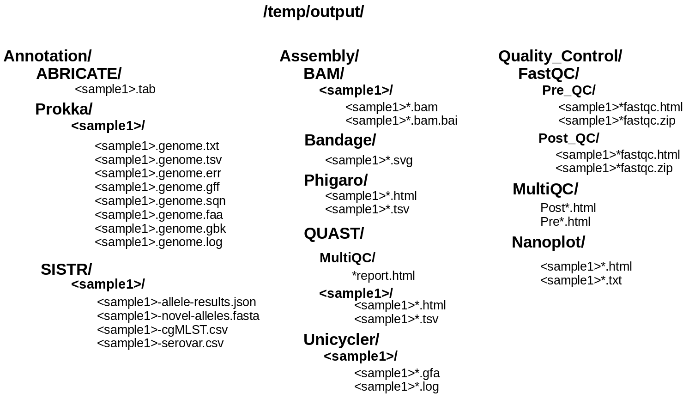

Output
------

### Output Modules

Output files are written to the user-defined output directory (default: test/) Below we discuss the types of output files produced from each pipeline module and where they can be found on your system.

It is advised to copy the files into a separate location to prevent overwriting previous results:
```
cp -rL /temp/output/* ~/<desired_location>
```
### Overview of output directories and contents



#### Module FastQC
FastQC produces html reports for raw sequence data in FASTQ format. These reports include content related to:
  - Sequence content
  - Sequence quality
  - GC content
  - Sequence length distribution
  - Adapter contamination
  
    
#### Module Trimmomatic

Trimmomatic removes low quality base pairs, adapter sequences and other sequence fragments. This module takes in as input a collection of FASTQ read pairs and a FASTA formatted adapter sequence file. By default, Nextera adapter sequences are used. 
(fill in)
As output, this module produces four outputs:
  - sample.1P.fastq
  - sample.2P.fastq
  - sample.1U.fastq
  - sample.2U.fastq
  

#### Module Unicycler

Unicycler is a hybrid and non-hybrid genome assembler, built on top of the SPADES assembler.

As output, this module procudes two outputs:
  - sample.assembly.fasta  
  - sample.assembly.gfa  
  - sample.unicycler.log

#### Module QUAST

QUAST is a tool for evaluating different features of a genome assembly and is a great way to guage the quality of an assembly.

#### Module MultiQC

MultiQC is a tool that can take outputs produced from open-source bioinformatics tools (log files, genome assemblies, or alignment files) and turn them into easy-to-view html reports.

#### Module NanoPlot
(fill in)

#### Module ARIBA
(fill in)

#### Module Prokka
(fill in)
