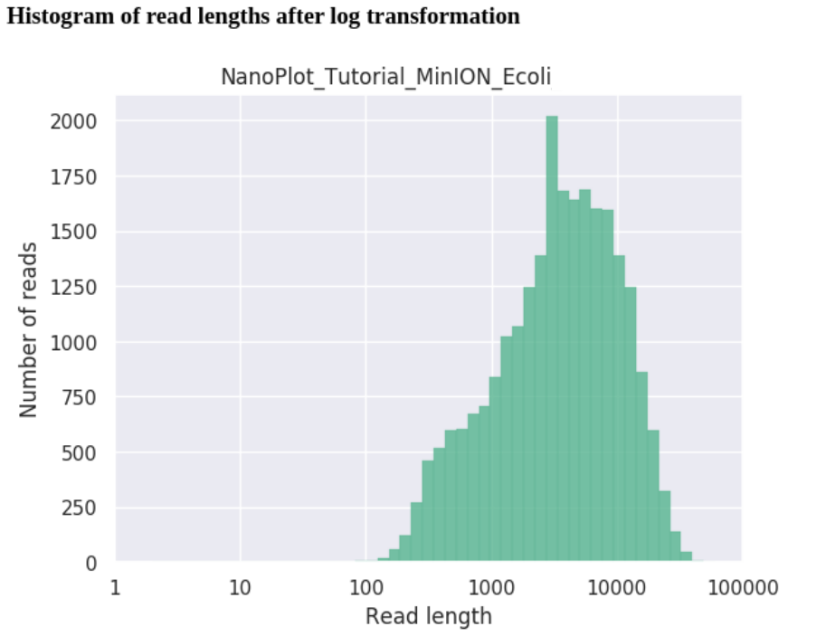
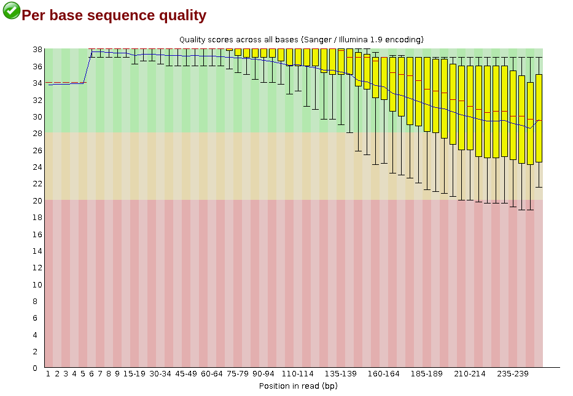
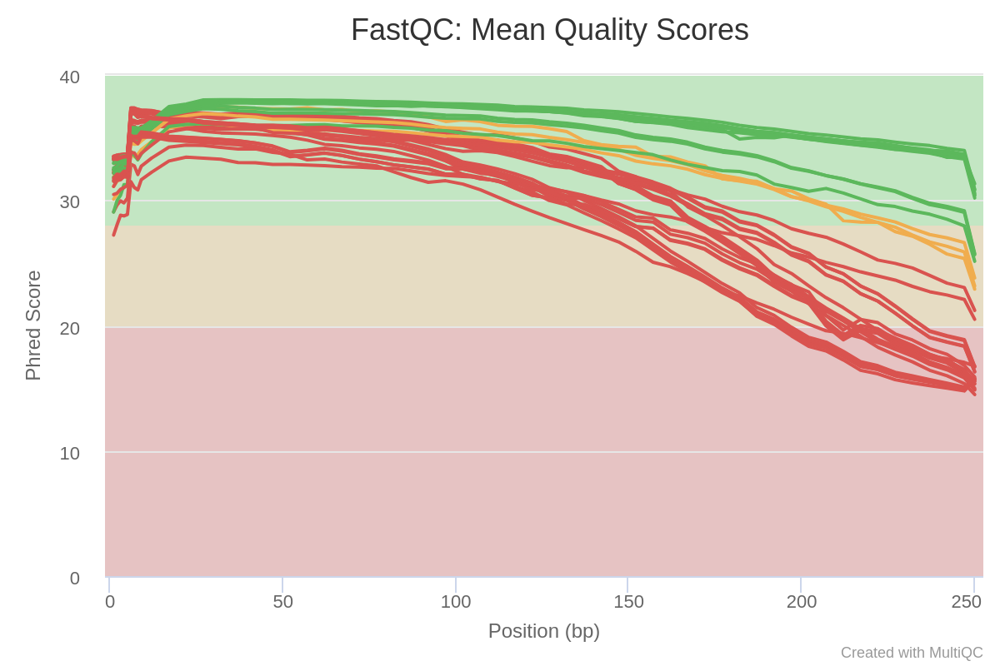
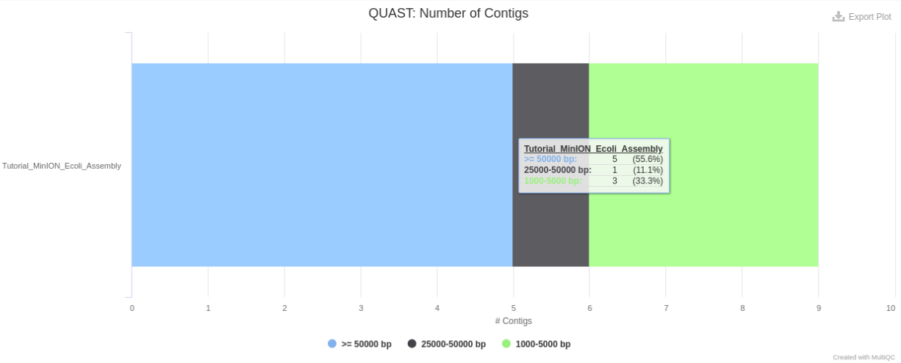
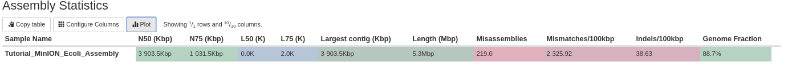
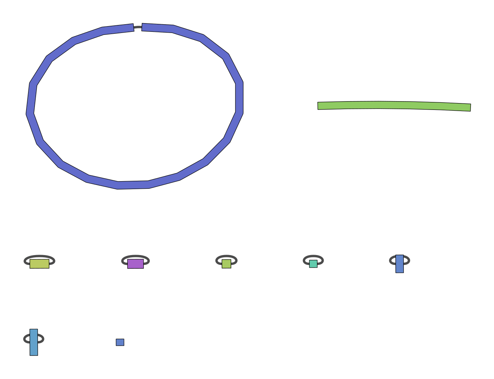
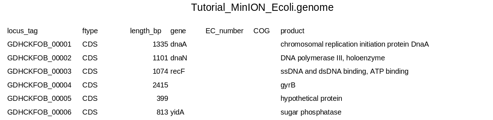
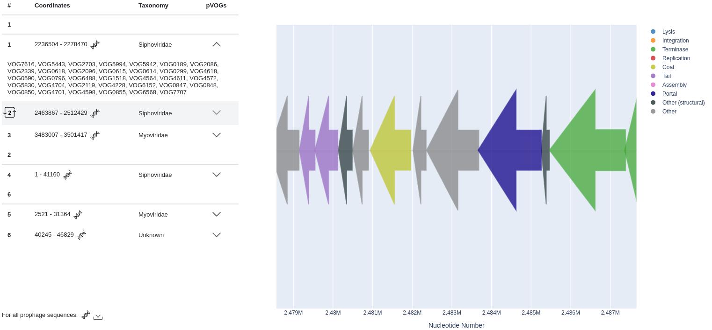
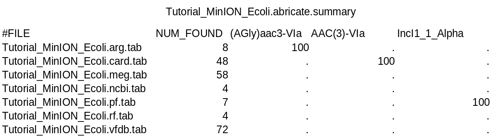

Process Overview
----------------

### NanoPlot
Plotting tool for long read sequencing data and alignments.

### Trimmomatic
A fast, multithreaded command line tool that can be used to trim and crop
Illumina (FASTQ) data as well as to remove adapters.

### FastQC
A quality control tool for high throughput sequence data.

### Unicycler
A hybrid assembly pipeline for bacterial genomes.

### QUAST
Quality Assessment Tool for Genome Assemblies.

### Bandage
A Bioinformatics Application for Navigating De novo Assembly Graphs Easily.

### Prokka
Rapid prokaryotic genome annotation.

### Phigaro
A standalone command-line application that is able to detect prophage regions taking raw genome and metagenome assemblies as an input.

### ABRICATE
Mass screening of contigs for antimicrobial and virulence genes.

### SISTR
An open web-accessible tool for rapidly typing and subtyping draft Salmonella genome assemblies.

### MultiQC
A reporting tool that parses summary statistics from results and log files generated by other bioinformatics tools.

